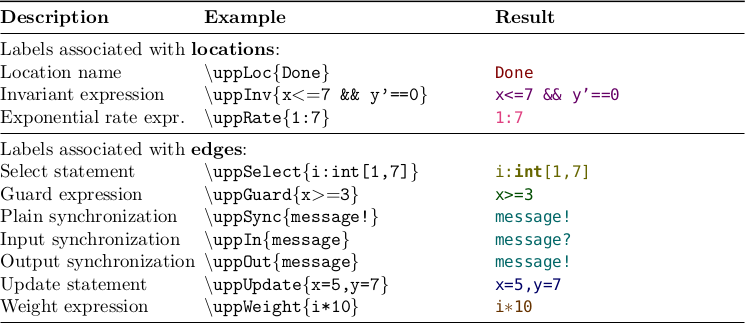
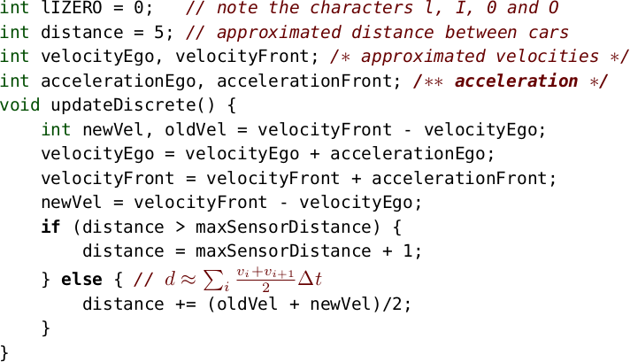
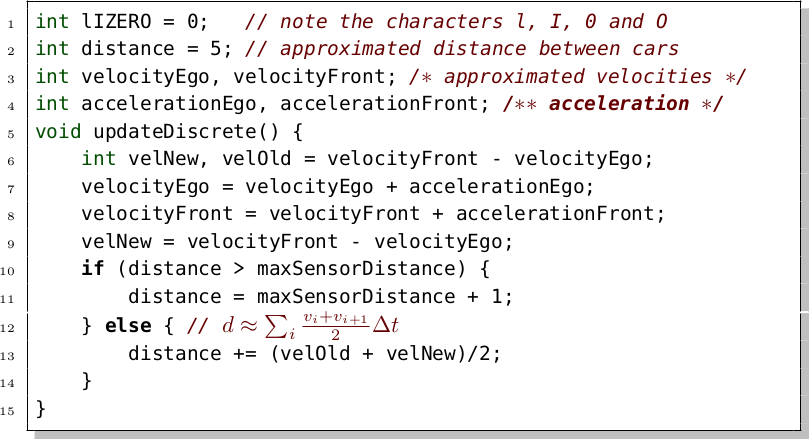

# Uppaal Style for LaTeX
LaTeX package to typeset Uppaal timed automata specifications.

The style depends on `listings.sty`, `xcolor.sty` and `xspace.sty`.

## Inline Examples

Properties in a table:


Timed automata labels:




## Listing Examples

Minimal `uppaalcode` environment:



Customized using `lstlisting` options:




## Instructions

1. Make sure that `listings`, `xcolor` and `xspace` are installed. In Linux distributions this is usually found in `texlive-latex-recommended` (`sudo apt-get install texlive-latex-recommended`).

2. Make sure that the font `beramono` is installed (usually ships as `fvm*` files with `texlive-font-extra`)

3. Download `uppaal.sty` from [releases](https://github.com/DEIS-Tools/uppaal-latex/releases) and put it into your LaTeX project directory.

4. Add `\usepackage{uppaal}` to your main .tex file.

5. Embed Uppaal code into your .tex files, like:

```LaTeX
\begin{uppaalcode}[caption={Updates velocity and position.},label={lst:updatecode}]
int lIZERO = 0;   // note the characters l, I, 0 and O
int distance = 5; // approximated distance between cars
int velocityEgo, velocityFront; /* approximated velocities */
int accelerationEgo, accelerationFront; /** acceleration */
void updateDiscrete() {
    int newVel, oldVel = velocityFront - velocityEgo;
    velocityEgo = velocityEgo + accelerationEgo;
    velocityFront = velocityFront + accelerationFront;
    newVel = velocityFront - velocityEgo;
    if (distance > maxSensorDistance) {
        distance = maxSensorDistance + 1;
    } else { // $d \approx \sum_i \frac{v_i+v_{i+1}}{2}\Delta t$
        distance += (oldVel + newVel)/2;
    }
}
\end{uppaalcode}
```

See `manual.pdf` from [releases](https://github.com/DEIS-Tools/uppaal-latex/releases) for more details on how to customize.
